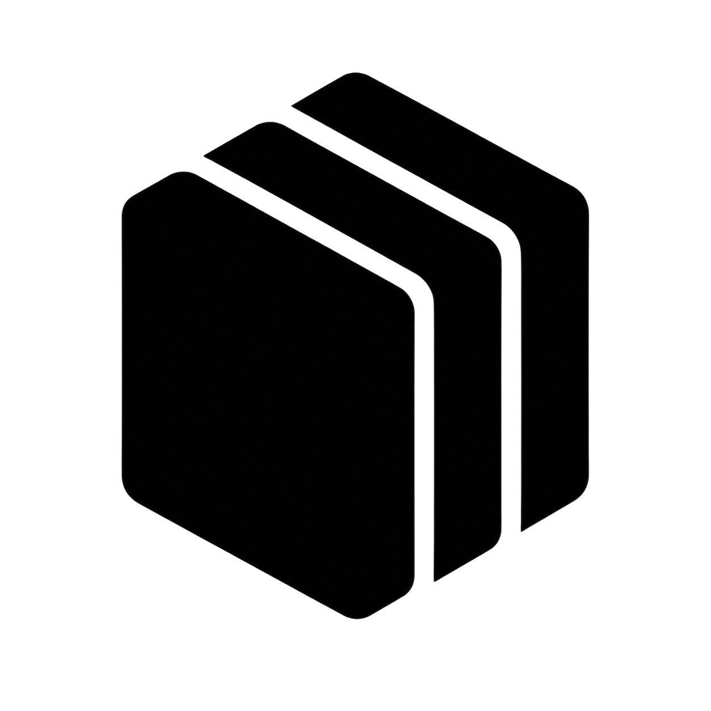
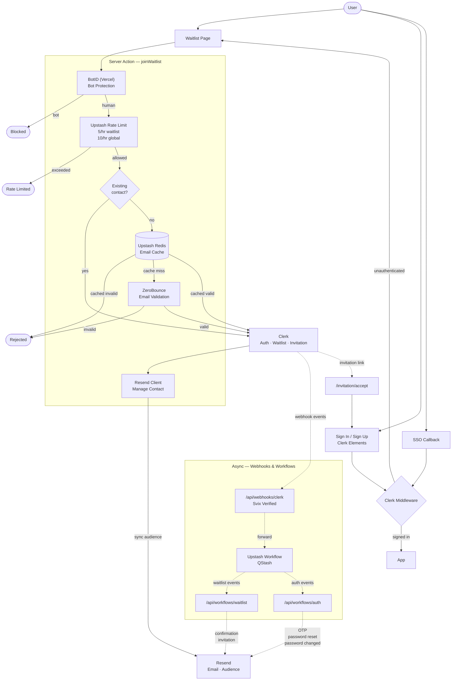

<p align="center">
  <picture>
    <source media="(prefers-color-scheme: dark)" srcset="public/logo-dark.png">
    
  </picture>
</p>

<h3 align="center">Gitscoop</h3>

<p align="center">
  Know any codebase before you touch it. Waitlist now open.
</p>

<p align="center">
  <a href="#overview">Overview</a> •
  <a href="#architecture">Architecture</a> •
  <a href="#running-locally">Running Locally</a> •
  <a href="#utility-scripts">Utility Scripts</a> •
  <a href="#tech-stack">Tech Stack</a>
</p>

## Overview

Gitscoop is currently in **waitlist mode**. Emails are collected through a robust, multi-layered pipeline. Before an entry is registered, it passes through Vercel BotID, strict rate limiting via Upstash Redis, and real-time email validation via ZeroBounce.

Rather than relying on basic webhooks, durable Upstash Workflows are utilized to orchestrate asynchronous confirmation and invitation emails. Authentication bypasses the default Clerk Account Portal completely in favor of custom Clerk Elements, handling sign-in, sign-up, password resets, and invite acceptance natively. Beyond that, all transactional emails are intercepted from Clerk and routed through tailored Resend templates.

## Architecture

The diagram below illustrates the high-level architecture of the waitlist and authentication pipelines.



## Running Locally

Follow these steps to set up and run Gitscoop arrival on your local machine.

### Prerequisites

This application requires **[Node.js](https://nodejs.org) 24.11.1** and **[pnpm](https://pnpm.io) 11.2.2**, both pinned via `.nvmrc` and `devEngines` in `package.json`. With pnpm 11+ already installed, `pnpm install` auto-enforces the exact versions for both.

Bootstrap (Node 22+ and pnpm 11+ required for the first install):

- **nvm:** `nvm install && nvm use`, then `npm install -g pnpm@11`
- **Other:** install [Node 24.11.1](https://nodejs.org), then `npm install -g pnpm@11`

Verify with `node -v` → `v24.11.1` and `pnpm -v` → `11.2.2` after running `pnpm install`.

Accounts on [Clerk](https://clerk.com), [Resend](https://resend.com), [Upstash](https://upstash.com), [ZeroBounce](https://www.zerobounce.net), and [ngrok](https://ngrok.com) for exposing local callback endpoints.

### 1. Cloning the Repository

```bash
git clone https://github.com/gitscoop/arrival.git
cd arrival
```

### 2. Installing Dependencies

```bash
pnpm install
```

### 3. Environment Variables

Create a local environment file by copying the example:

```bash
cp .env.example .env
```

> [!IMPORTANT]
> Open the newly created `.env` file and populate it with your specific service values. The file groups variables by service for convenience. Never commit your `.env` file.

### 4. Local URL and Ngrok Setup

Portless serves the local app at `https://gitscoop.localhost`. Ngrok provides the external routing needed for Clerk webhooks, Upstash workflows, and email redirects.

1. [Install ngrok](https://ngrok.com/docs) and sign in.
2. Grab your free dev domain from the [ngrok dashboard](https://dashboard.ngrok.com) (e.g. `your-subdomain.ngrok-free.app`).
3. Set `NEXT_PUBLIC_APP_URL` in `.env` to that full origin, including `https://`.
4. Portless runs the Next.js dev server on port `3000` so ngrok can target it reliably.
5. Start the stable public tunnel in a separate terminal:

   ```bash
   ngrok http 3000 --url https://your-subdomain.ngrok-free.app
   ```

### 5. Services Configuration

**Clerk**

- **Waitlist Mode**: In the dashboard, navigate to **Waitlist** → toggle on **Enable waitlist**.
- **Webhooks**: Go to **Webhooks** → **Add Endpoint**. URL: `https://your-subdomain.ngrok-free.app/api/webhooks/clerk`. Subscribe to `email.created`, `waitlistEntry.created`, `waitlistEntry.updated`. Copy the **Signing Secret** to `CLERK_WEBHOOK_SECRET` in `.env`.
- **Disable Default Delivery**: Under **Customization** → **Emails**, toggle off **Delivered by Clerk** for `verification_code`, `reset_password_code`, and `password_changed`, because Gitscoop intercepts them.
- **Account Portal**: Navigate to **Account Portal** and click **Disable Account Portal** to ensure all auth routes through custom Clerk Elements.
- **Keys**: Set `NEXT_PUBLIC_CLERK_PUBLISHABLE_KEY` and `CLERK_SECRET_KEY` in `.env`.

**Resend**

- Add a sending domain (e.g., `ops.yourdomain.com`) and verify your DNS records.
- Create a specific segment/audience for waitlist users. Set `RESEND_SEGMENT_ID` in `.env`.
- Create your templates: Waitlist confirmation, Waitlist invitation, Verification code, Password reset code, and Password changed. Set their respective `RESEND_*_TEMPLATE_ID`s in `.env`.
- Copy your API key to `RESEND_API_KEY`.

**Upstash**

- **Redis**: Create a Redis database. Add `UPSTASH_REDIS_REST_URL` and `UPSTASH_REDIS_REST_TOKEN`.
- **QStash**: Navigate to the QStash tab. Copy `QSTASH_TOKEN`, `QSTASH_CURRENT_SIGNING_KEY`, and `QSTASH_NEXT_SIGNING_KEY` into your `.env`.

**ZeroBounce**

- Grab your API key from the ZeroBounce dashboard and set `ZEROBOUNCE_API_KEY`.

### 6. Running the Application

Start the Next.js dev server via Portless once your ngrok tunnel is active in a separate terminal:

```bash
pnpm dev:portless
```

> [!NOTE]
> Open `https://gitscoop.localhost` in your browser to access the local app.
> Running `pnpm dev:portless` automatically cleans up stale Portless processes. Use `pnpm dev:prune` to do a full cleanup manually.

## Utility Scripts

Manage cached data and rate limits directly from your CLI:

| Command                      | Description                           |
| :--------------------------- | :------------------------------------ |
| `pnpm redis`                 | Interactive Redis CLI terminal        |
| `pnpm redis:clear:ratelimit` | Clear all active rate limit keys      |
| `pnpm redis:clear:emails`    | Clear cached email validation results |
| `pnpm redis:flush`           | Flush the entire Redis database       |

## Tech Stack

Primary tools and services powering the application:

| Category          | Technology                                                                               |
| :---------------- | :--------------------------------------------------------------------------------------- |
| **Framework**     | [Next.js 16](https://nextjs.org)                                                         |
| **Language**      | [TypeScript](https://www.typescriptlang.org)                                             |
| **Auth**          | [Clerk](https://clerk.com)                                                               |
| **Email**         | [Resend](https://resend.com)                                                             |
| **Orchestration** | [Upstash Workflow](https://upstash.com/docs/workflow/getstarted)                         |
| **Caching & RL**  | [Upstash Redis](https://upstash.com/docs/redis/overall/getstarted)                       |
| **Validation**    | [ZeroBounce](https://www.zerobounce.net)                                                 |
| **Analytics**     | [Vercel Analytics](https://vercel.com/docs/analytics)                                    |
| **Security**      | [Vercel BotID](https://vercel.com/docs/botid) + [FingerprintJS](https://fingerprint.com) |
| **Styling**       | [Tailwind CSS v4](https://tailwindcss.com) + [shadcn/ui](https://ui.shadcn.com)          |
| **Local Dev URL** | [Portless](https://portless.sh)                                                          |
| **Public Tunnel** | [Ngrok](https://ngrok.com)                                                               |
